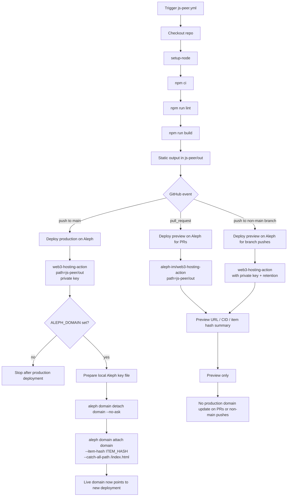

# Rootfs Profiles

This directory defines relay-owned metadata for Aleph VM rootfs packaging.

The goal is to keep relay-specific packaging inputs in `universal-connectivity`
 while letting the generic qcow2/Aleph publishing logic live elsewhere.

For now, the contract is intentionally narrow and only covers `uc-go-peer`.

## Approach

Each profile file describes:

- which relay subtree is the source of truth
- which rootfs profile name the external builder should use
- the default install mode
- service names and install paths that are useful for review and future tooling
- the expected externally exposed ports

The first consumer of this contract is the GitHub workflow in
`.github/workflows/build-aleph-go-peer-rootfs.yml`.

## Diagrams

### 1. Go Relay Rootfs Creation And Aleph Publish

```mermaid
flowchart TD
    A[Workflow dispatch<br/>build-aleph-go-peer-rootfs.yml] --> B[Checkout universal-connectivity]
    B --> C[Read deploy/rootfs-profiles/uc-go-peer.json]
    C --> D[Export contract-derived env<br/>ROOTFS_PROFILE<br/>ROOTFS_INSTALL_MODE<br/>ROOTFS_CONTRACT_FILE]
    D --> E[Checkout rootfs builder repo<br/>NiKrause/aleph-libp2p-relay]
    E --> F[Install build dependencies<br/>libguestfs/qemu/docker/python]
    F --> G{publish=true?}
    G -- no --> H[Skip Aleph client/account setup]
    G -- yes --> I[Install aleph-client]
    I --> J[Write ~/.aleph-im/config.json<br/>and ~/.aleph-im/private-keys/aleph-vm.key]
    H --> K[Run relay-deployer-pwa/rootfs/build-rootfs.sh]
    J --> K
    K --> L[Load contract with read-rootfs-contract.py]
    L --> M[Select profile uc-go-peer<br/>and install mode prebaked]
    M --> N{Builder driver}
    N -->|CI| O[Use Dockerized Debian/libguestfs builder]
    N -->|local Linux| P[Use host virt-customize path]
    O --> Q[Run build-rootfs-image.sh]
    P --> Q
    Q --> R[Download Debian cloud image]
    R --> S[Resize qcow2]
    S --> T[Tar universal-connectivity/go-peer<br/>into dist-rootfs/uc-go-peer.tar]
    T --> U[virt-customize copies scripts/services<br/>and runs bootstrap base/build/finalize]
    U --> V[Emit aleph-uc-go-peer.qcow2]
    V --> W{publish=true?}
    W -- no --> X[Write local artifacts only]
    W -- yes --> Y[Upload qcow2 to Aleph IPFS add endpoint]
    Y --> Z[Extract CID]
    Z --> AA[aleph file pin CID]
    AA --> AB[Extract rootfs item hash]
    X --> AC[Write rootfs-manifest.json]
    AB --> AC[Write rootfs-manifest.json<br/>including rootfsItemHash]
    AC --> AD[Upload workflow artifacts<br/>qcow2/manifest/json logs]
```

### 2. What Happens Inside `relay-deployer-pwa`

```mermaid
flowchart TD
    A[build-rootfs.sh] --> B[Resolve repo paths and output directory]
    B --> C[Optionally load ROOTFS_CONTRACT_FILE]
    C --> D[read-rootfs-contract.py]
    D --> E[Emit shell assignments<br/>profile/install mode/ports/notes]
    E --> F[Validate profile + install mode]
    F --> G[Resolve rootfs version]
    G --> H{SKIP_BUILD?}
    H -- yes --> I[Reuse existing qcow2]
    H -- no --> J{ROOTFS_BUILD_DRIVER}
    J -->|auto on CI| K[Prefer Docker builder]
    J -->|host| L[Use host virt-customize/qemu-img]
    J -->|docker| K
    K --> M[build_with_docker]
    L --> N[build_with_host_tools]
    M --> O[Build rootfs/Dockerfile.rootfs]
    O --> P[Mount workspace into builder container]
    P --> Q[Run build-rootfs-image.sh inside container]
    N --> Q

    subgraph Image Build Logic
      Q --> R[Download base Debian qcow2 if missing]
      R --> S[Copy and resize base image]
      S --> T{ROOTFS_PROFILE}
      T -->|uc-go-peer| U[Create uc-go-peer.tar from universal-connectivity/go-peer]
      U --> V[virt-customize --mkdir /opt/go-peer]
      V --> W[virt-customize --mkdir /var/lib/uc-go-peer]
      W --> X[Copy uc-go-peer scripts and systemd units]
      X --> Y[Run uc-go-peer-bootstrap.sh base]
      Y --> Z[Run uc-go-peer-bootstrap.sh build]
      Z --> ZA[Run uc-go-peer-bootstrap.sh finalize]
      ZA --> ZB[Enable services and produce qcow2]
    end

    ZB --> ZC{SKIP_UPLOAD?}
    ZC -- yes --> ZD[Stop after local qcow2]
    ZC -- no --> ZE[upload_image]
    ZE --> ZF[curl POST file to ipfs.aleph.cloud/api/v0/add]
    ZF --> ZG[Parse CID from ipfs-add-response.jsonl]
    ZG --> ZH[Run aleph file pin CID]
    ZH --> ZI[Parse item_hash from store-message.json]
    ZI --> ZJ[write_manifest]
    ZD --> ZJ
    ZJ --> ZK[rootfs-manifest.json<br/>profile/version/ports/notes/item hash]
```

### 3. `js-peer` Build, Aleph Publish, And Domain Linking

## File Ownership Guide

- `universal-connectivity/deploy/rootfs-profiles/uc-go-peer.json`:
  relay-owned contract for profile selection, install mode, ports, and notes.
- `universal-connectivity/.github/workflows/build-aleph-go-peer-rootfs.yml`:
  CI entrypoint that reads the contract and invokes the external builder repo.
- `relay-deployer-pwa/rootfs/build-rootfs.sh`:
  top-level rootfs orchestration, builder selection, upload orchestration, manifest writing.
- `relay-deployer-pwa/rootfs/read-rootfs-contract.py`:
  adapter from relay contract JSON to shell environment variables.
- `relay-deployer-pwa/rootfs/build-rootfs-image.sh`:
  profile-specific qcow2 customization logic, including the `virt-customize` steps.
- `relay-deployer-pwa/rootfs/uc-go-peer-bootstrap.sh`:
  actual base/build/finalize behavior executed inside the guest image for the Go relay.
- `universal-connectivity/.github/workflows/js-peer.yml`:
  static site preview deploys, production deploys, and production domain linking.
