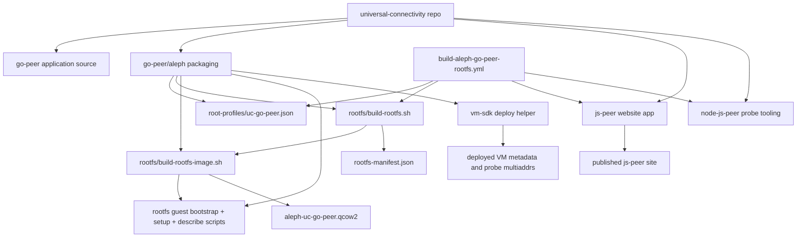
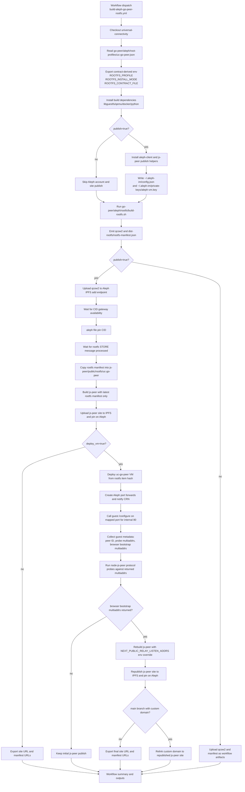
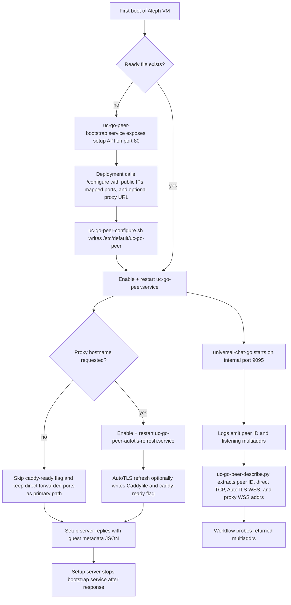

# Go Peer Aleph Packaging

This directory contains the Aleph-specific packaging and publishing flow for the
`go-peer` relay.

The main idea is:

- `go-peer` stays the application source of truth
- `go-peer/aleph/root-profiles` defines the packaging contract and exposed ports
- `go-peer/aleph/rootfs` contains the in-repo qcow2 builder and guest bootstrap scripts
- `.github/workflows/build-aleph-go-peer-rootfs.yml` builds and optionally publishes the Aleph VM image

This setup is intentionally narrow. It currently supports only the prebaked
`uc-go-peer` rootfs image and does not try to remain a generic multi-profile VM
builder.

## Layout

- `root-profiles/uc-go-peer.json`
  The relay-owned contract for install paths, services, port forwards, and manifest notes.
- `rootfs/build-rootfs.sh`
  Top-level orchestrator for local/CI builds, optional Aleph publish, and manifest generation.
- `rootfs/build-rootfs-image.sh`
  The actual qcow2 customization logic using `virt-customize`.
- `rootfs/Dockerfile.rootfs`
  Dockerized Debian/libguestfs build environment used when host tooling is not preferred.
- `rootfs/uc-go-peer-*`
  Guest-side bootstrap, configure, setup, AutoTLS refresh, and systemd service files.

## Diagrams

### 1. Repository-Level Flow



### 2. Workflow End-To-End: Rootfs, VM, Probe, And Site Republish



### 3. What Happens Inside `go-peer/aleph/rootfs`

```mermaid
flowchart TD
    A[build-rootfs.sh] --> B[Resolve repo paths and output directory]
    B --> C[Load ROOTFS_CONTRACT_FILE]
    C --> D[read-rootfs-contract.py]
    D --> E[Emit shell assignments<br/>install paths/services/ports/notes]
    E --> F[Validate uc-go-peer + prebaked mode]
    F --> G[Resolve rootfs version]
    G --> H{SKIP_BUILD?}
    H -- yes --> I[Reuse existing qcow2]
    H -- no --> J{ROOTFS_BUILD_DRIVER}
    J -->|auto on CI| K[Prefer Docker builder]
    J -->|host| L[Use host virt-customize/qemu-img]
    J -->|docker| K
    K --> M[build_with_docker]
    L --> N[build_with_host_tools]
    M --> O[Build go-peer/aleph/rootfs/Dockerfile.rootfs]
    O --> P[Mount universal-connectivity into builder container]
    P --> Q[Run build-rootfs-image.sh inside container]
    N --> Q

    subgraph Image Build Logic
      Q --> R[Download base Debian qcow2 if missing]
      R --> S[Copy and resize base image]
      S --> T[Build universal-chat-go with host/container Go toolchain]
      T --> U[virt-customize --mkdir /opt/go-peer]
      U --> V[virt-customize --mkdir /var/lib/uc-go-peer]
      V --> W[Copy binary, scripts, and systemd units]
      W --> X[Run uc-go-peer-bootstrap.sh base]
      X --> Y[Run uc-go-peer-bootstrap.sh build validation]
      Y --> Z[Run uc-go-peer-bootstrap.sh finalize]
      Z --> ZA[Enable services and produce qcow2]
    end

    ZA --> ZB{SKIP_UPLOAD?}
    ZB -- yes --> ZC[write_manifest without item hash]
    ZB -- no --> ZD[upload_image]
    ZD --> ZE[curl POST file to ipfs.aleph.cloud/api/v0/add]
    ZE --> ZF[Parse CID from ipfs-add-response.jsonl]
    ZF --> ZG[Wait until CID is retrievable from Aleph IPFS gateway]
    ZG --> ZH[Run aleph file pin CID]
    ZH --> ZI[Wait for STORE message processed]
    ZI --> ZJ[Parse item_hash from store-message.json]
    ZC --> ZK[rootfs-manifest.json<br/>profile/version/ports/notes]
    ZJ --> ZK[rootfs-manifest.json<br/>profile/version/ports/notes/item hash]
```



### 4. Runtime Behavior Inside The VM



### 5. How `js-peer` Gets Its Relay Bootstrap Addresses

```mermaid
flowchart TD
    A[js-peer build starts] --> B{NEXT_PUBLIC_RELAY_LISTEN_ADDRS set in build env?}
    B -- yes --> C[Use explicit secure websocket relay multiaddrs from workflow]
    B -- no --> D[Use NEXT_PUBLIC_BOOTSTRAP_PEER_IDS or built-in BOOTSTRAP_PEER_IDS]
    D --> E[Query delegated routing for peer records]
    E --> F[Filter browser-dialable addrs:<br/>tls/ws or webtransport]
    F --> G[Append /p2p/peerId]
    C --> H[Ship compiled site with resolved relay bootstrap list]
    G --> H

    I[Workflow first publish] --> J[js-peer/public/rootfs/uc-go-peer/latest.json]
    I --> K[js-peer/public/rootfs/uc-go-peer/${ROOTFS_VERSION}.json]
    J --> H
    K --> H

    L[Workflow second publish after VM deploy] --> M[Guest returns browser_bootstrap_multiaddrs_json]
    M --> N[Workflow sets NEXT_PUBLIC_RELAY_LISTEN_ADDRS only for rebuild]
    N --> H
```

## File Ownership Guide

- `universal-connectivity/go-peer/go-peer`
  The application binary source tree that gets packaged into the image.
- `universal-connectivity/go-peer/aleph/root-profiles/uc-go-peer.json`
  Relay-owned contract for install mode, directories, services, port forwards, and manifest notes.
- `universal-connectivity/go-peer/aleph/rootfs/build-rootfs.sh`
  Top-level rootfs orchestration, builder selection, upload orchestration, and manifest writing.
- `universal-connectivity/go-peer/aleph/rootfs/read-rootfs-contract.py`
  Adapter from contract JSON to shell environment variables.
- `universal-connectivity/go-peer/aleph/rootfs/build-rootfs-image.sh`
  qcow2 customization logic for the prebaked `uc-go-peer` image.
- `universal-connectivity/go-peer/aleph/rootfs/uc-go-peer-bootstrap.sh`
  Guest-side base/build/finalize provisioning inside the image.
- `universal-connectivity/go-peer/aleph/rootfs/uc-go-peer-configure.sh`
  Post-deployment port/public-IP configuration inside the VM.
- `universal-connectivity/go-peer/aleph/rootfs/uc-go-peer-setup-server.py`
  Temporary HTTP setup endpoint that accepts Aleph port-mapping information.
- `universal-connectivity/go-peer/aleph/rootfs/uc-go-peer-autotls-refresh.py`
  AutoTLS hostname extraction and announce-address normalization after startup.
- `universal-connectivity/go-peer/aleph/rootfs/uc-go-peer-describe.py`
  Guest-side metadata extractor used after configuration to report the relay peer ID and probe/bootstrap multiaddrs.
- `universal-connectivity/.github/workflows/build-aleph-go-peer-rootfs.yml`
  CI entrypoint for building and optionally publishing the Aleph rootfs image.
- `universal-connectivity/.github/workflows/uc-go-peer-rootfs-reusable.yml`
  Main reusable workflow that builds the rootfs, publishes manifests, optionally deploys the VM, runs protocol probes, and republishes `js-peer` with deployed relay addresses.

## Headless VM Deploy SDK

For workflow-driven VM creation, `go-peer/aleph/vm-sdk` now contains a small
headless Aleph deploy helper that mirrors the useful parts of the deployer PWA
without the browser wallet dependency.

- `go-peer/aleph/vm-sdk/lib/aleph-vm-sdk.mjs`
  Reusable functions for:
  `listGeocodedCrns()`
  `deployVm()`
  `waitForDeploymentResult()`
  `fetchVmRuntime()`
  `deployVmAndWait()`
- `.github/actions/aleph-vm-deploy/action.yml`
  Composite GitHub Action wrapper that installs the SDK and returns:
  host IPv4, IPv6, proxy URL, mapped ports JSON, a ready-to-use SSH command,
  setup-endpoint reachability, and post-configure verification results.

The important architectural split is:

- the PWA still owns the browser signing flow
- the SDK/action uses a headless EVM private key for GitHub Actions
- for `uc-go-peer`, the action also publishes the required Aleph port-forward
  aggregate, waits for runtime mappings, calls the temporary setup endpoint on
  the mapped external port for internal `80`, and then verifies the durable
  ports after configuration

Example workflow usage:

```yaml
- name: Deploy uc-go-peer VM on Aleph
  id: deploy_vm
  uses: ./.github/actions/aleph-vm-deploy
  with:
    aleph_private_key: ${{ secrets.ALEPH_PRIVATE_KEY }}
    name: uc-go-peer-demo
    ssh_public_key: ${{ secrets.VM_SSH_PUBLIC_KEY }}
    rootfs_item_hash: ${{ needs.build_rootfs.outputs.rootfs_item_hash }}
    rootfs_size_mib: '20480'
    crn_hash: ${{ vars.ALEPH_CRN_HASH }}
    vcpus: '1'
    memory_mib: '1024'
    auto_configure: 'true'
    verify_reachability: 'true'

- name: Show resulting access details
  run: |
    echo "Host IPv4: ${{ steps.deploy_vm.outputs.host_ipv4 }}"
    echo "Setup endpoint was reachable: ${{ steps.deploy_vm.outputs.setup_endpoint_ok }}"
    echo "Proxy URL: ${{ steps.deploy_vm.outputs.web_proxy_url }}"
    echo "SSH: ${{ steps.deploy_vm.outputs.ssh_command }}"
    echo "Ports: ${{ steps.deploy_vm.outputs.mapped_ports_json }}"
    echo "Verification: ${{ steps.deploy_vm.outputs.verification_json }}"
```

## Published Site Bootstrap Refresh

When the reusable workflow is run with both `publish=true` and `deploy_vm=true`,
it now performs a two-pass `js-peer` publish:

1. Build and publish the rootfs image, rootfs manifests, and an initial
   `js-peer` site.
2. Deploy the `uc-go-peer` VM and wait for the guest to report its final relay
   multiaddrs.
3. Extract browser-dialable secure websocket relay addresses from the deployed
   VM metadata.
4. Rebuild `js-peer` with `NEXT_PUBLIC_RELAY_LISTEN_ADDRS` set to those final
   deployed relay addresses.
5. Republish the `js-peer` site and, on `main`, relink the custom domain to the
   republished site.

This keeps the live website bootstrap list aligned with the relay that was just
deployed instead of leaving the site pointed at stale bootstrap addresses.

One important implementation detail:

- the workflow does not edit a checked-in `.env` file in the repository
- instead, the second `js-peer` build injects `NEXT_PUBLIC_RELAY_LISTEN_ADDRS`
  as a build-time environment variable
- `js-peer/src/lib/libp2p.ts` prefers that variable over delegated-routing
  bootstrap discovery when it is present
