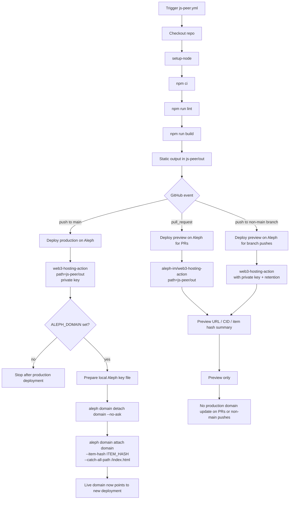

# Rootfs Profiles

This directory defines relay-owned metadata for Aleph VM rootfs packaging.

The goal is to keep the Aleph build contract close to the Go relay itself, with
the qcow2 builder scripts living in `go-peer/aleph/rootfs`.

For now, the contract is intentionally narrow and only covers `uc-go-peer`.

## Approach

Each profile file describes:

- which relay subtree is the source of truth
- which rootfs profile name the in-repo builder should use
- the default install mode
- service names and install paths that are useful for review and future tooling
- the expected externally exposed ports

The first consumer of this contract is the GitHub workflow in
`.github/workflows/build-aleph-go-peer-rootfs.yml`.

## Diagrams

### 1. Go Relay Rootfs Creation And Aleph Publish

```mermaid
flowchart TD
    A[Workflow dispatch<br/>build-aleph-go-peer-rootfs.yml] --> B[Checkout universal-connectivity]
    B --> C[Read go-peer/aleph/root-profiles/uc-go-peer.json]
    C --> D[Export contract-derived env<br/>ROOTFS_PROFILE<br/>ROOTFS_INSTALL_MODE<br/>ROOTFS_CONTRACT_FILE]
    D --> E[Install build dependencies<br/>libguestfs/qemu/docker/python]
    E --> F{publish=true?}
    F -- no --> G[Skip Aleph client/account setup]
    F -- yes --> H[Install aleph-client]
    H --> I[Write ~/.aleph-im/config.json<br/>and ~/.aleph-im/private-keys/aleph-vm.key]
    G --> J[Run go-peer/aleph/rootfs/build-rootfs.sh]
    I --> J
    J --> K[Load contract with read-rootfs-contract.py]
    K --> L[Validate uc-go-peer<br/>and prebaked mode]
    L --> M{Builder driver}
    M -->|CI| N[Use Dockerized Debian/libguestfs builder]
    M -->|local Linux| O[Use host virt-customize path]
    N --> P[Run build-rootfs-image.sh]
    O --> P
    P --> Q[Download Debian cloud image]
    Q --> R[Resize qcow2]
    R --> S[Tar universal-connectivity/go-peer<br/>into dist-rootfs/uc-go-peer.tar]
    S --> T[virt-customize copies scripts/services<br/>and runs bootstrap base/build/finalize]
    T --> U[Emit aleph-uc-go-peer.qcow2]
    U --> V{publish=true?}
    V -- no --> W[Write local rootfs-manifest.json]
    V -- yes --> X[Upload qcow2 to Aleph IPFS add endpoint]
    X --> Y[Extract CID]
    Y --> Z[aleph file pin CID]
    Z --> AA[Extract rootfs item hash]
    AA --> AB[Write rootfs-manifest.json<br/>including rootfsItemHash]
    W --> AC[Upload workflow artifacts<br/>qcow2/manifest/json logs]
    AB --> AC
```

### 2. What Happens Inside `go-peer/aleph/rootfs`

```mermaid
flowchart TD
    A[build-rootfs.sh] --> B[Resolve repo paths and output directory]
    B --> C[Load ROOTFS_CONTRACT_FILE]
    C --> D[read-rootfs-contract.py]
    D --> E[Emit shell assignments<br/>install paths/services/ports/notes]
    E --> F[Validate uc-go-peer + prebaked mode]
    F --> G[Resolve rootfs version]
    G --> H{SKIP_BUILD?}
    H -- yes --> I[Reuse existing qcow2]
    H -- no --> J{ROOTFS_BUILD_DRIVER}
    J -->|auto on CI| K[Prefer Docker builder]
    J -->|host| L[Use host virt-customize/qemu-img]
    J -->|docker| K
    K --> M[build_with_docker]
    L --> N[build_with_host_tools]
    M --> O[Build go-peer/aleph/rootfs/Dockerfile.rootfs]
    O --> P[Mount universal-connectivity into builder container]
    P --> Q[Run build-rootfs-image.sh inside container]
    N --> Q

    subgraph Image Build Logic
      Q --> R[Download base Debian qcow2 if missing]
      R --> S[Copy and resize base image]
      S --> T[Create uc-go-peer.tar from universal-connectivity/go-peer]
      T --> U[virt-customize --mkdir /opt/go-peer]
      U --> V[virt-customize --mkdir /var/lib/uc-go-peer]
      V --> W[Copy uc-go-peer scripts and systemd units]
      W --> X[Run uc-go-peer-bootstrap.sh base]
      X --> Y[Run uc-go-peer-bootstrap.sh build]
      Y --> Z[Run uc-go-peer-bootstrap.sh finalize]
      Z --> ZA[Enable services and produce qcow2]
    end

    ZA --> ZB{SKIP_UPLOAD?}
    ZB -- yes --> ZC[write_manifest without item hash]
    ZB -- no --> ZD[upload_image]
    ZD --> ZE[curl POST file to ipfs.aleph.cloud/api/v0/add]
    ZE --> ZF[Parse CID from ipfs-add-response.jsonl]
    ZF --> ZG[Run aleph file pin CID]
    ZG --> ZH[Parse item_hash from store-message.json]
    ZH --> ZI[write_manifest]
    ZC --> ZJ[rootfs-manifest.json<br/>profile/version/ports/notes]
    ZI --> ZJ[rootfs-manifest.json<br/>profile/version/ports/notes/item hash]
```

### 3. `js-peer` Build, Aleph Publish, And Domain Linking

## File Ownership Guide

- `universal-connectivity/go-peer/aleph/root-profiles/uc-go-peer.json`:
  relay-owned contract for profile selection, install mode, ports, and notes.
- `universal-connectivity/.github/workflows/build-aleph-go-peer-rootfs.yml`:
  CI entrypoint that reads the contract and invokes the in-repo Aleph builder.
- `universal-connectivity/go-peer/aleph/rootfs/build-rootfs.sh`:
  top-level rootfs orchestration, builder selection, upload orchestration, manifest writing.
- `universal-connectivity/go-peer/aleph/rootfs/read-rootfs-contract.py`:
  adapter from relay contract JSON to shell environment variables.
- `universal-connectivity/go-peer/aleph/rootfs/build-rootfs-image.sh`:
  qcow2 customization logic for the prebaked `uc-go-peer` image, including the `virt-customize` steps.
- `universal-connectivity/go-peer/aleph/rootfs/uc-go-peer-bootstrap.sh`:
  actual base/build/finalize behavior executed inside the guest image for the Go relay.
- `universal-connectivity/.github/workflows/js-peer.yml`:
  static site preview deploys, production deploys, and production domain linking.
